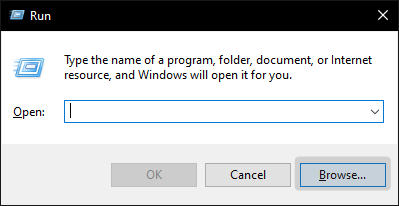

# iPadOS cursor for Windows

This small AutoIt script will add the iPadOS cursor to your Windows desktop.

## What the script **does**

* Add a transparent circle placed in the position of the mouse cursor
* Morph into a thin bar over text editing controls
* Morph into the shape of a button over some Win32 buttons (sometimes unpredictable)

## What the script **does not**

* Hide the default system cursor
* Recognize UWP controls or controls in browser windows
* Work on multi-monitor setups

it was made in an hour, okay?

